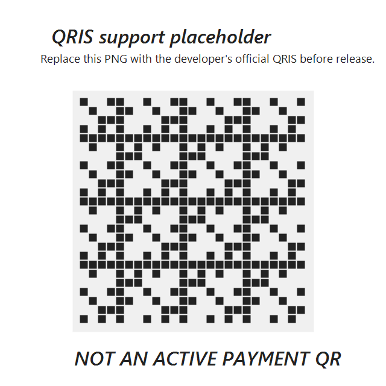

# Notifu - Your Waifu Notification

Notifu is a local Windows notification assistant with an anime-style desktop pet. It reads Windows toast notifications, turns them into short natural announcements, speaks them out loud, and shows a floating chat bubble that slides in from the right side of the screen.


The current build is a PowerShell MVP so it can run on Windows without .NET SDK, Visual Studio Build Tools, or a packaged installer.

## Features

- Reads Windows toast notifications through `UserNotificationListener`.
- Supports all incoming notification apps by default, with allow/block list settings.
- Shows a custom floating popup, not a normal Windows balloon notification.
- Popup slides in from the right, uses typewriter text, and has cute chat-bubble styling.
- Desktop pet walks at the bottom of the screen and shows bubble replies in real time.
- Character expression changes by notification context: happy, talking, curious, focused, worried, sleepy.
- Speaks announcements through local Windows voice, OpenAI TTS, or a user-supplied RVC voice-conversion model.
- Voice command is opt-in by button/menu click, not always-on microphone recording.
- AI mode can use OpenAI Responses API when the user provides an API key.
- Local heuristic fallback still works without any cloud key.
- Quick actions: open source app, copy draft reply, repeat announcement, pause/resume, dismiss bubble.

## Privacy Promise

Notifu is designed for local-first use.

- The developer does not collect private user data.
- There is no developer-operated telemetry server in this repo.
- By default, notification processing happens locally on the user's machine.
- Notifu only reads text that Windows already exposes in Notification Center.
- It does not read WhatsApp databases, browser databases, private app storage, or encrypted message stores.
- It does not send replies automatically. Draft replies are copied only when the user chooses.
- Voice command listens only after the user clicks the voice button or tray menu.
- OpenAI API calls happen only when the user adds their own `OPENAI_API_KEY`.
- RVC model files are user-supplied and are not included in this repository.

For extra privacy, set:

```json
{
  "privacy": {
    "readMessageBody": false,
    "storeHistory": false
  }
}
```

## Install

Requirements:

- Windows 10/11
- Windows PowerShell 5.1
- Notification access allowed in Windows privacy settings

Clone and enter the project:

```powershell
git clone https://github.com/Eugenewijaya/Notifu.git
cd Notifu
```

Generate local image/icon assets if needed:

```powershell
powershell -ExecutionPolicy Bypass -File .\scripts\build-assets.ps1
```

Install shortcuts and startup entry for the current Windows user:

```powershell
powershell -ExecutionPolicy Bypass -File .\scripts\install.ps1
```

Run Notifu:

```powershell
powershell -ExecutionPolicy Bypass -File .\scripts\run.ps1
```

Run with visible PowerShell window:

```powershell
powershell -ExecutionPolicy Bypass -File .\scripts\run.ps1 -Visible
```

Open settings:

```powershell
powershell -ExecutionPolicy Bypass -File .\scripts\settings.ps1
```

Uninstall shortcuts and startup entry:

```powershell
powershell -ExecutionPolicy Bypass -File .\scripts\uninstall.ps1
```

## Test

Check notification listener access and current Notification Center items:

```powershell
powershell -ExecutionPolicy Bypass -File .\scripts\test-notifications.ps1 -All
```

Test only notifications tracked by Notifu settings:

```powershell
powershell -ExecutionPolicy Bypass -File .\scripts\test-notifications.ps1
```

Preview popup, desktop pet, and speech:

```powershell
powershell -ExecutionPolicy Bypass -STA -File .\scripts\test-popup.ps1
```

Test RVC/fallback voice:

```powershell
powershell -ExecutionPolicy Bypass -File .\scripts\test-rvc.ps1
```

## Configuration

Main settings live in:

```text
config/notifu.settings.json
```

Read every notification except blocked apps:

```json
{
  "notifications": {
    "mode": "all",
    "blockAppNameContains": ["Notifu"]
  }
}
```

Read only specific apps:

```json
{
  "notifications": {
    "mode": "allowlist",
    "allowAppNameContains": ["WhatsApp", "Telegram", "Discord", "Slack"]
  }
}
```

## AI And Voice

Without an API key, Notifu uses local rules and Windows voice.

To enable cloud AI and natural TTS, create `.env.local` in the project root:

```text
OPENAI_API_KEY=your_key_here
```

Then choose a provider in settings:

```json
{
  "voice": {
    "provider": "openai"
  }
}
```

For RVC, provide your own `.pth` and `.index` model paths in `config/notifu.settings.json`. Model files are intentionally not committed.

## Project Structure

```text
assets/                 Mascot, expression, icon, and QRIS placeholder images
config/                 User-editable app settings
docs/                   PRD and implementation notes
scripts/                Install, run, test, speech, RVC, and asset scripts
src/                    PowerShell app, core logic, and WinForms UI
```

## Support Developer

QRIS support is planned for the public repo. This checkout includes a clearly marked placeholder:



Before a real release, replace it with the developer's official QRIS image at:

```text
assets/support-qris.png
```

Do not use the placeholder as a payment QR.

## Roadmap

- Native Windows app package.
- Better speech recognition for Indonesian voice commands.
- Reminder queue and quiet hours.
- Per-app notification rules.
- Safer draft-reply workflow per chat app.
- Higher-quality Live2D/Spine-style character animation.

## License

MIT. See [LICENSE](LICENSE).
